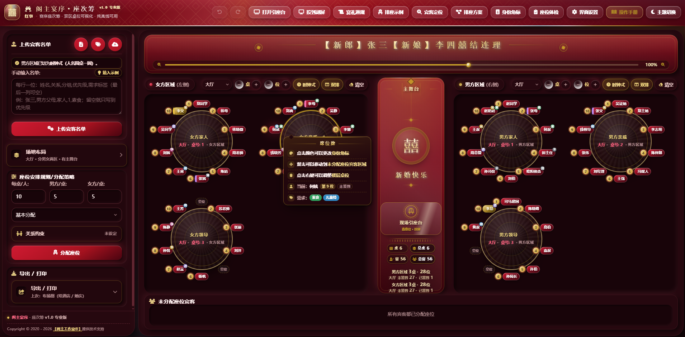

# 宴席排座项目

原始资料归档，暂未进行功能扩展或界面优化。

## 附件

- [原始网页代码](index.html)：用户提供的 HTML 文本原样保存为 `index.html`，可下载后用浏览器打开。当前为单桌餐位排布工具，包含名单输入、圆桌排位、拖动调整和浏览器本地缓存。
- [界面参考截图](references/banquet-seating-reference.png)：用户提供的双区、多桌宴席排座界面，用于后续设计参考。截图展示的功能不代表当前代码已经实现。

## 开发接续

每次继续前先读 [最新备份记录](BACKUP-LOG.md)，并遵循 [分阶段备份规则](AGENTS.md)。

[开发接续记录](DEVELOPMENT-HANDOFF.md) 保存了已知需求、源码初步检查、设计方向、建议方案及验证清单。下次从这里继续即可。

## 使用场景

目标支持 **婚宴、年度年会和团建用餐**。后续将逐步支持活动标题、部门/小组分组、自定义区域和场景主题，避免固定为男女方分区或婚庆装饰。上述多场景适配尚未实现，当前仍为原始单桌工具。

附加需求：支持临时加桌和小孩桌，可单独设置桌名及席位数，保留原有排座；尚未实现。

所有桌均计划支持独立改名，例如「企划部」「工程部」，改名不改变已排座位；尚未实现。

已确认流程：**导入名单 → 分桌排座并调整 → 导出带桌位编号的名单**，例如 `1-1`（第1桌第1座）、`2-5`（第2桌第5座）；未分配宾客明确标注。尚未完整实现。

已确认两种导出结果：**带桌位编号的宾客名单**（查人）与 **每桌座位图**（打印摆放）。未安排人员标为「未分配」，不得遗漏；尚未实现。

第一版补充规则（尚未实现）：允许同名宾客并提示重复导入；统一首座及编号方向；导出前检查重复安排、超员和未分配；锁定已确认桌位，防止重新分配打乱人工安排。

## 开发原则

**以现有 `index.html` 源码为基础增量开发，优先复用已有功能，不默认重写或更换框架。每次小步修改、必要验证、简短记录，减少重复消耗 token。**

## 后续方向（尚未实现）

结合参考截图评估男女方分区、多桌布局、主舞台、宾客搜索、分配及调座、撤销重做、备份导入导出和打印。具体范围后续再确定。

## 状态与来源

本次仅归档两个原始附件，未改写网页代码、未验证完整功能，也未部署在线网站。

资料由用户提供；原代码和参考界面的权利归原权利人所有。本仓库不另行授予原始材料开源许可。
